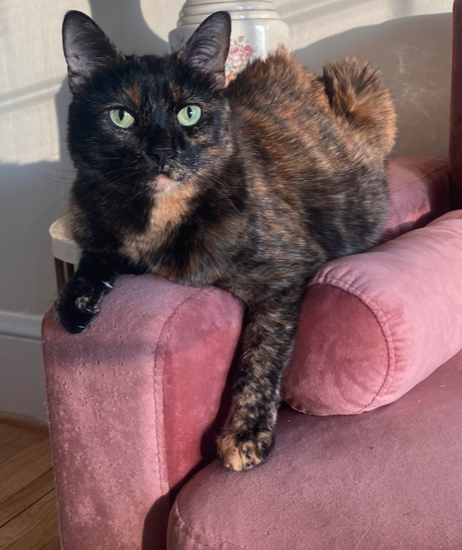

[wireframe about Arrow app](./assets/bow-on-couch-2.png) insert pic of to wireframe after assets/) -->

<!DOCTYPE html>
<html>
    <head>
    </head>
<main>
    <body>
        <h1>Bow's World</h1>

        

        <h2>About Bow</h2>

        
Bow is the most perfect speciment to ever be birthed. This is why:

        <ul>
            <li>She has stunning eyes</li>
            <li>She likes to cuddle</li>
            <li>She will give tiny kisses on your eyelashes</li>
        </ul>

</body>
</main>

</html>
